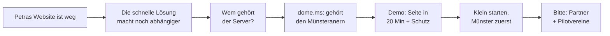

# dome.ms – Deep Research für den Pitch

Sep 25, 2026 · @Sophia

## Kurzfazit

**Die Idee trägt, aber unser USP ist ein anderer, als wir dachten.** Cloudflare blockt KI-Crawler seit dem 15.09.2026 gratis. Was niemand bietet, ist Web-Infrastruktur, die den Nutzern selbst gehört, vor Ort betrieben wird und für Nicht-Techniker funktioniert.

1. **Kernsatz für den Pitch:** *„Wo der Server steht, ist egal. Entscheidend ist, wem er gehört.“* Der CLOUD Act hält als Argument, aber genau formuliert: Herausgabe auf richterliche Anordnung, nicht „die USA sehen alles“. Cloudflare ist aktuell DSGVO-konform, nur mit Rechtsunsicherheit.
2. **Vorbild sind die Energiegenossenschaften, nicht Cloudflare.** 998 Genossenschaften, 220.000 Mitglieder: Bürger besitzen Infrastruktur vor Ort, getragen von lokalen Banken und Handwerk. CHATONS in Frankreich macht fast genau unser Modell fürs Hosting.
3. **Die größte Gefahr heißt Gaia-X:** zu viele Beteiligte, zu wenig Produkt. Die zweitgrößte heißt De-Mail: Souveränität verkauft nichts, wenn die Bedienung umständlich ist. Also: klein starten, Einfachheit über alles.
4. **Unternehmen zahlen, Vereine bringen Reichweite.** Mit \~310 Mitgliedern trägt sich eine Vollzeitstelle. Die richtigen Geldgeber sind nicht VCs, sondern Stadtwerke, Volksbanken, LVM und Förderprogramme. Der Prototype Fund (bis 158.333 €) öffnet am 01.10.2026.
5. **Die größte unbewiesene Annahme:** dass Hosting-Partner Server stellen. Eine einzige Absichtserklärung vor dem Pitch wäre mehr wert als jede Folie.

## Faktencheck: Was hält, was nicht

Die meisten Kernaussagen halten. Drei müssen wir aber entschärfen: „Cloudflare ist DSGVO-widrig“, „nur Cloudflare ist bezahlbar“ und „statische Seiten sind unhackbar“.

| Aussage im Pitch | Urteil | Was stimmt / wie wir es sagen |
| --- | --- | --- |
| Über die Hälfte des Web-Traffics sind Bots | Hält | 57,5 % der HTML-Anfragen sind automatisiert (Cloudflare Radar, Juni 2026), 53 % laut Imperva Bad Bot Report 2026. |
| KI-Crawler nehmen viel, geben wenig zurück | Hält | GPTBot \~1.276 Crawls pro Besucher, der zurückkommt; Google \~5. Über die Hälfte der KI-Crawls dient dem Training, nicht der Suche. |
| Jede fünfte Website läuft über Cloudflare | Hält | \~20 % aller Websites (W3Techs, Nov. 2025); die Nr. 2 (Amazon CloudFront) liegt bei 1–2 %. |
| Ein Cloudflare-Fehler legt große Teile des Netzes lahm | Hält | 18.11.2025: X, ChatGPT und tausende Seiten stundenlang gestört. |
| CLOUD Act: US-Firmen müssen Daten herausgeben, auch aus EU-Rechenzentren | Hält, genau formulieren | Gilt für Firmen unter US-Jurisdiktion, auf richterliche Anordnung in Strafverfahren, mit Widerspruchsmöglichkeit. **Nicht** „die USA sehen alles“. Kernsatz: *Wo der Server steht, ist egal. Entscheidend ist, wem er gehört.* |
| Cloudflare zu nutzen ist DSGVO-widrig | Hält nicht | Das EU-Gericht hat das EU-US Data Privacy Framework am 03.09.2025 bestätigt (Fall Latombe). Die Berufung vor dem EuGH läuft. Richtig ist also: **rechtlich erlaubt, aber mit Unsicherheit.** Schrems I und II haben die Vorgänger schon zweimal gekippt. |
| Strafgerichtshof verlor Microsoft-Mail nach US-Sanktionen | Umstritten | Berichtet von mehreren Medien, Microsoft bestreitet, Dienste eingestellt zu haben. Belegt ist: Der IStGH wechselt zu openDesk (deutsches Open Source). Nur in der Fragerunde nutzen. |
| Cloudflare ist der einzige bezahlbare Schutz | Hält nicht | Es gibt Bunny.net (EU), Anubis und CrowdSec (Open Source), Hoster-DDoS-Schutz. Richtig: *Cloudflare ist der Standard, fast ohne Konkurrenz.* |
| Statische Seiten kann man nicht hacken | Übertrieben | Keine Datenbank, kein Login, kaum Angriffsfläche, aber Konten, Build-Pipeline und DNS bleiben angreifbar. Sagen: *„kaum Angriffsfläche“*. |
| 87 % der Firmen betroffen, 289 Mrd. € Schaden | Hält, aber passt nur halb | Bitkom Wirtschaftsschutz 2025. Umfasst Diebstahl, Spionage und Sabotage allgemein, nicht Website-Angriffe. Nur als Rahmen nutzen, nicht als Beleg für unser Problem. |
| In Münster wurde die Souveränität erfunden | Übertrieben | Die Stadt Münster selbst schreibt: „ein Grundstein“ für die Gleichberechtigung souveräner Staaten. Historiker nennen „Westfälische Souveränität“ teils einen späteren Mythos. Sagen: *„Hier wurde der Grundstein gelegt.“* |
| Stadtwerke-Nodes wehren DDoS ab | Hält nicht | Große Angriffe (100+ Gbit/s) schafft kein lokaler Anschluss. Wir schützen gegen Bots, Scanner und Angriffe auf Anwendungsebene, das ehrlich sagen. |
| Domain dome.ms | Offen | .ms ist die Länderendung von Montserrat. Verfügbarkeit, Preis und Registrierungsregeln vor dem Pitch prüfen. |

## Konkurrenz im Detail

Technisch können wir niemanden überholen. Unsere Lücke ist die Kombination aus **lokal, gemeinschaftlich besessen, für Nicht-Techniker und bezahlbar**, die hat kein Anbieter.

**Wichtigste neue Erkenntnis:** Cloudflare blockt seit dem 15.09.2026 auch auf dem Gratis-Tarif standardmäßig KI-Trainings- und Agent-Crawler. Seit Juli 2025 gibt es außerdem „Pay per Crawl“. **KI-Bot-Schutz allein ist damit kein USP mehr.** Er ist Pflicht-Feature, das Alleinstellungsmerkmal liegt woanders.

| Anbieter | Herkunft | Was er kann | Preis (Einstieg) | Schwäche aus unserer Sicht |
| --- | --- | --- | --- | --- |
| [Cloudflare](https://blog.cloudflare.com/content-independence-day-ai-options/) | USA | CDN, DDoS, WAF, KI-Bot-Block, Pages-Hosting | 0 € | US-Jurisdiktion (CLOUD Act), Klartext-Zugriff, Klumpenrisiko (\~20 % des Webs), kein persönlicher Support |
| [Myra Security](https://omr.com/en/reviews/product/myra-security/pricing) | Deutschland | DDoS, WAF, CDN, Bot-Management, BSI-zertifiziert | ab 399 €/Monat | Für Behörden und Konzerne; für Verein oder Bäckerei unerreichbar |
| Link11 | Deutschland | DDoS, CDN, kritische Infrastruktur | auf Anfrage | Enterprise-Fokus |
| [Bunny.net / Bunny Shield](https://bunny.net/docs/shield/pricing) | Slowenien | CDN, DDoS, WAF, Bot-Erkennung | günstig, nutzungsbasiert | Selbstbedienung für Entwickler, keine lokale Community |
| Gcore, CDN77 | Luxemburg, Tschechien | CDN, DDoS | nutzungsbasiert | Technische Produkte, kein Website-Bau |
| [CrowdSec](https://www.securityweek.com/crowdsec-raises-14-million-crowdsourced-threat-intelligence-solution/) | Frankreich | Open-Source-Bot-/Angriffserkennung mit geteilter Blockliste, 100.000+ Installationen | Kern gratis | Braucht eigenen Server und Admin. **Für uns Baustein, nicht Gegner.** |
| [Anubis](https://www.helpnetsecurity.com/2025/12/22/anubis-open-source-web-ai-firewall-protect-from-bots/) | Open Source | Proof-of-Work-Schutz gegen KI-Scraper | gratis | Keine Verhaltensanalyse, nur für Techniker. Ebenfalls Baustein |
| Jimdo, Wix, IONOS | DE / Israel / DE | Website-Baukasten inkl. Hosting | günstiger Abo-Einstieg | Kein Schutz eigener Server, schwieriger Export, keine Mitbestimmung. IONOS ist deutsch, also souverän, aber ein Konzern |
| [Hostsharing eG](https://de.wikipedia.org/wiki/Hostsharing) | Deutschland | Genossenschaftliches Hosting seit 2000, nur Open Source | Mitgliedsbeitrag + Tarif | Kein Schutz-Proxy, kein Baukasten, \~260 Mitglieder, für Techniker |

**Was das für uns heißt:**

- **Nicht gegen Cloudflare antreten, sondern die Frage stellen: „Wem gehört eure Infrastruktur?“** Bei Funktionen und Preis verlieren wir, bei Eigentum, Nähe und Einfachheit gewinnen wir.
- **CrowdSec, Anubis, Coraza und Caddy sind unsere Zutaten.** Die Botschaft wird dadurch stärker: *„Wir erfinden die Sicherheits-Technik nicht neu, wir machen sie für alle nutzbar, die keinen Admin haben.“* Das ist glaubwürdiger als eine eigene KI-Erkennung, die in 48 Stunden entsteht.
- **Der eigentliche Konkurrent für Petra ist nicht Cloudflare, sondern Jimdo und der Neffe.** Für Vereine gewinnen wir über Einfachheit und „gehört uns“, nicht über Sicherheit.
- **Hostsharing ist der Beweis, dass ein genossenschaftlicher Hoster über 25 Jahre überlebt**, aber auch, dass er klein bleibt, wenn er nur Techniker anspricht.

## Vorbilder: Was funktioniert hat

Gemeinschaftliche Infrastruktur funktioniert, wenn sie **klein und konkret startet, ein sofort spürbares Problem löst und lokale Träger hat**. Keiner der Erfolge hat mit „Souveränität“ geworben, sie alle haben mit einem Nutzen geworben.

| Vorbild | Was | Zahlen | Warum es funktioniert |
| --- | --- | --- | --- |
| [Energiegenossenschaften](https://www.dgrv.de/news/dgrv-jahresumfrage-energiegenossenschaften-2025/) | Bürger finanzieren und besitzen Solar- und Windanlagen vor Ort | 998 Genossenschaften, 220.000 Mitglieder, 3,6 Mrd. € investiert | Motiv laut DGRV: Klimaschutz **und regionale Wertschöpfung**. Partner: lokale Banken und Handwerk. Mitbestimmung schafft Akzeptanz. **Das ist unser nächstes Vorbild.** |
| [Codeberg e.V.](https://en.wikipedia.org/wiki/Codeberg) | Vereinsbetriebenes Git-Hosting, GitHub-Alternative | Seit 2019, 1.100+ Mitglieder, 200.000+ Konten, 2022 nur \~1.050 € Kosten im Monat | Sehr schlank, Open Source. Große Wechselwellen kamen, als GitHub Nutzer verärgert hat (Zig 2025, Gentoo 2026). |
| [Hostsharing eG](https://de.wikipedia.org/wiki/Hostsharing) | Erste Hosting-Genossenschaft | Seit 2000, \~260 Mitglieder (2020) | Hat 25 Jahre überlebt; Mitglieder dürfen Leistungen weiterverkaufen, so wurden IT-Dienstleister zu Vertriebspartnern. |
| [CHATONS](https://fr.wikipedia.org/wiki/Collectif_des_h%C3%A9bergeurs_alternatifs,_transparents,_ouverts,_neutres_et_solidaires) | Netzwerk kleiner lokaler Hoster in Frankreich mit gemeinsamer Charta | Seit 2016, \~100 Mitglieder | Kein zentraler Anbieter, sondern ein **Bund lokaler Anbieter mit gemeinsamen Regeln**. 2020 hat das Netz Last von überlasteten Mitgliedern auf andere verteilt. **Nahezu identisch mit unserer Föderations-Idee.** |
| [Freifunk Münsterland](https://freifunk-muensterland.de/was-ist-freifunk/) | Bürger-WLAN, getragen von Ehrenamt und Förderverein | Aktiv in Münster, Warendorf und Umland | Zeigt: In Münster gibt es genau diese Community schon. Natürlicher Partner, kein Konkurrent. |
| [Schleswig-Holstein](https://gnulinux.ch/schleswig-holstein-liefert-ab) / [openDesk](https://www.irishlegal.com/articles/icc-to-ditch-microsoft-following-us-sanctions) | Umstieg der öffentlichen Hand auf Open Source | SH: 40.000 Postfächer in 6 Monaten umgestellt (Okt. 2025); IStGH wechselt zu openDesk | Politischer Wille und ein konkreter Anlass. Zeigt, dass Souveränität gerade von „nett“ zu „wird umgesetzt“ wechselt. |

**Muster über alle Erfolge hinweg:**

1. **Wechsel passiert bei Anlässen.** Codeberg wächst, wenn GitHub ärgert, openDesk nach den Sanktionen. Für uns heißt das: Der Anlass ist der Moment, in dem Petras Website weg ist. Da müssen wir mit einem fertigen Angebot stehen.
2. **Nutzen zuerst, Werte als Grund zum Bleiben.** Energiegenossenschaften verkaufen Strom, nicht Klimapolitik.
3. **Lokale Träger schaffen Vertrauen.** Volksbank, Handwerk, Stadtwerke, genau die Rolle, die wir den Hosting-Mitgliedern geben.
4. **Schlank bleiben.** Codeberg läuft mit zwei Teilzeitkräften. Wer auf Ehrenamt und Open Source setzt, braucht keine große Organisation.

## Gescheitert: Was wir nicht wiederholen dürfen

Die gescheiterten Projekte hatten fast alle gute Absichten. Sie sind an **zu viel Anspruch, zu wenig Nutzen und schlechter Bedienung** gescheitert, nicht an der Technik.

| Projekt | Was es sein sollte | Was passiert ist | Warum |
| --- | --- | --- | --- |
| [Gaia-X](https://euro-stack.com/blog/2025/2/gaia-x-failure) | Europäische souveräne Cloud | Feststeckend im Konzeptstadium; Scaleway 2021 ausgetreten; Ex-CEO: „zu ambitioniert“ | Zu viele Interessen am Tisch, Papier statt Produkt, US-Hyperscaler als Mitglieder aufgenommen, politische Rückendeckung verloren |
| [De-Mail](https://www.techbook.de/mobile-lifestyle/de-mail-ende) | Sichere, rechtsverbindliche Mail vom Staat | Telekom 2022 raus, endgültiges Aus am 31.12.2026 | Umständliche Registrierung, Gebühren pro Nachricht, keine echte Ende-zu-Ende-Verschlüsselung, nicht kompatibel mit normaler Mail. Das einzige Argument war die staatliche Anerkennung, nicht der Nutzen |
| [Diaspora](https://slate.com/technology/2014/10/ello-diaspora-and-the-anti-facebook-why-alternative-social-networks-cant-win.html) / Ello | Dezentrale, werbefreie Alternative zu Facebook | Nische geblieben | Definierten sich über „nicht Facebook“ statt über eigenen Nutzen; leeres Netzwerk, technische Probleme am Start |
| Verwaiste Open-Data-Portale (häufiges Muster) | Städtische Daten maschinenlesbar | Viele Datensätze veralten nach dem Launch | Daten werden einmal hochgeladen, aber niemand pflegt sie. Unsere Antwort: Die Daten kommen aus Websites, die ohnehin gepflegt werden |

**Was wir daraus lernen:**

- **Gaia-X ist unser größtes Warnsignal.** „Stadtwerke, Uni, IHK, Stadt und 50 Vereine an einem Tisch“ ist unser Moat, kann aber auch zu unserem Gaia-X werden. Gegenmittel: mit drei Partnern und zehn Seiten starten, erst liefern, dann groß werden. **Keine Konzerne als Hosting-Mitglieder**, die das Projekt verwässern.
- **De-Mail zeigt: Souveränität allein verkauft nichts.** Wenn es umständlicher ist als Jimdo, nutzt es niemand, egal wie gut das Argument ist. Petras 20 Minuten sind das wichtigste Versprechen im ganzen Konzept.
- **Diaspora zeigt: Nicht „das Anti-Cloudflare“ sein.** Wir müssen über das sprechen, was wir sind (eine Website, die dem Verein gehört und in 20 Minuten steht), nicht über das, wogegen wir sind.
- **Open Data nur als Nebenprodukt**, nie als Pflichtaufgabe für Nutzer.

## Was wir bedenken müssen

Das größte Risiko ist nicht die Technik, sondern **Vertrauen und Verantwortung**: Wer den Traffic anderer im Klartext sieht und ihre Seiten hostet, übernimmt rechtliche Pflichten, die ein Hackathon-Team nicht tragen kann. Das braucht eine klare Antwort, bevor ein echter Kunde kommt.

| Bereich | Risiko | Wie wir damit umgehen (Pitch-Antwort) |
| --- | --- | --- |
| Rechtsform | Ein e. V. darf nicht hauptsächlich wirtschaftlich tätig sein. Hosting gegen Beitrag ist wirtschaftlich. Gemeinnützigkeit ist schwer zu bekommen, bei Freifunk ist sie [gescheitert](https://winheller.com/blog/freifunk-stoererhaftung-gemeinnuetzigkeit/). | Die Masterdatei hat die richtige Antwort: e. V. nur für Pilot und Community, **früh in eine eG überführen**. Eine eG kostet einmalig \~1.500–4.000 €, dazu Prüfverband und Prüfung ab \~1.000 € im Jahr ([Quelle](https://www.starting-up.de/gruenden/rechtsformen/eg-eingetragene-genossenschaft/das-kostet-die-genossenschaft.html)). Machbar. |
| Haftung für Inhalte | Als Hoster müssen wir auf Hinweise zu rechtswidrigen Inhalten reagieren (Digital Services Act, Notice and Takedown). | Nutzungsbedingungen, Meldeweg, Impressumspflicht der Mitglieder. Standard bei jedem Hoster. |
| Datenschutz | Im Schutz-Modus fließen personenbezogene Daten durch die Nodes der Partner. | AV-Verträge mit jedem Mitglied, Node-Betreiber-Vereinbarung, Audit. Das ist gleichzeitig unser Verkaufsargument: Man weiß, wer die Daten sieht. |
| NIS2 | Seit 06.12.2025 in Kraft, \~29.500 Einrichtungen betroffen ([Quelle](https://www.proliance.ai/blog/nis2-umsucg)). **DNS-Dienste fallen nach NIS2 unabhängig von der Größe darunter**, CDN-Anbieter ab einer bestimmten Größe. | Vor dem Betrieb juristisch prüfen lassen. Chance: NIS2-pflichtige Mittelständler brauchen nachweisbare Sicherheit bei Dienstleistern, ein zertifiziertes lokales Netz kann das liefern. |
| DDoS | Große Angriffe übersteigen jeden lokalen Anschluss. | Ehrlich abgrenzen: Schutz gegen Bots, Scanner, Angriffe auf Anwendungsebene. Upstream-Partner für Volumen-Angriffe. |
| „Lokaler Traffic bleibt lokal“ | Das Glasfasernetz der Stadtwerke-Tochter Stadtnetze Münster wird [von der Telekom gepachtet und betrieben](https://www.stadtnetze-muenster.de/anschliessen/glasfaser-und-internet). Ob Anfragen wirklich in Münster bleiben, hängt vom Peering ab. | Im Pitch nicht technisch versprechen. Besser: *„Ihre Daten liegen in Münster, bei Partnern, die Sie kennen.“* |
| Betrieb und Support | Wer ist nachts um drei da, wenn Petras Seite weg ist? Ehrenamt trägt keinen 24/7-Betrieb. | Statische Seiten auf mehreren Nodes fallen selten aus. Für den Schutz-Modus braucht es bezahlte Bereitschaft, finanziert durch Unternehmensbeiträge. |
| Anreiz der Hosting-Partner | Das Modell steht und fällt mit Partnern, die Server stellen. Warum sollten sie? | Sichtbarkeit als „Träger der digitalen Infrastruktur Münsters“, Mitbestimmung, Vergütung. **Heute die größte unbewiesene Annahme.** Mentoren gezielt fragen. |
| Gaia-X-Falle | Zu viele Beteiligte, zu wenig Produkt. | Klein starten: 2–3 Partner, 10 Seiten, erst liefern. |
| Domain | .ms gehört zu Montserrat, Regeln und Kosten unklar. | Vor dem Pitch prüfen. Plan B: Name unabhängig von der Domain wählen. |

## Geschäftsmodell und Finanzierung

**Unternehmen zahlen den Betrieb, Vereine bringen Reichweite und Gemeinschaft, Fördermittel finanzieren den Start.** Mit \~160 zahlenden Unternehmen und 150 Vereinen trägt sich eine volle Betriebsstelle (Rechenbeispiel unten).

**Wichtig für euer Ziel „Investoren sagen: Bitte umsetzen“:** Eine Genossenschaft ist für klassische Risikokapitalgeber uninteressant, weil es keinen Exit und nur eine Stimme pro Mitglied gibt. Das ist kein Nachteil, sondern ein anderes Publikum. Eure „Investoren“ sind **Stadtwerke, Volksbanken, Versicherer wie die LVM, NRW.BANK, Stiftungen und Förderprogramme**. Eine eG kann investierende Mitglieder aufnehmen, die Kapital geben, ohne das Netz zu übernehmen. Im Pitch heißt das: nicht nach VC-Geld fragen, sondern nach Partnern, Nodes und Pilotkunden.

### Preisvorschlag (im Team abstimmen)

| Mitgliedsart | Leistung | Beitrag (Vorschlag) | Vergleich |
| --- | --- | --- | --- |
| Verein, Initiative | Website, Subdomain, Hosting, Open Data | 5 €/Monat | Baukasten mit eigener Domain: meist teurer, kein Eigentum |
| Kleinunternehmen | Website, eigene Domain, Migration | 15 €/Monat | wie Jimdo/Wix, aber mit Mitbestimmung und Export |
| Unternehmen mit eigenem Server | Schutz-Modus: Proxy, WAF, Bot-Schutz, Dashboard | 49 €/Monat | Myra ab 399 €/Monat; Cloudflare gratis, aber US |
| Hosting-Mitglied | Stellt Nodes, wird zertifiziert | kein Beitrag bzw. Vergütung | Gegenleistung: Sichtbarkeit, Mitbestimmung |
| Einmalig | Genossenschaftsanteil (später eG) | z. B. 100 € | üblich bei Energiegenossenschaften |

### Warum wir so günstig sein können

- **Kein Gewinnziel, keine Investoren-Rendite.** Überschüsse bleiben im Netz.
- **Server-Kapazität kommt von den Partnern**, statt teuer eingekauft zu werden.
- **Statische Seiten kosten in der Auslieferung fast nichts**, ein kleiner Server trägt hunderte Vereinsseiten.
- **Open Source heißt null Lizenzkosten.** Bausteine wie CrowdSec, Coraza und Caddy gibt es schon; Entwicklungskosten teilen sich später mehrere Städte.
- **Schlanke Organisation** nach dem Vorbild von Codeberg (2 Teilzeitkräfte für 200.000 Konten).

### Rechenbeispiel: Ab wann trägt es sich?

Annahme: eine Vollzeitstelle für Betrieb und Support, \~60.000 € pro Jahr inkl. Nebenkosten (Schätzung).

| Mitglieder | Anzahl | Beitrag/Jahr | Summe/Jahr |
| --- | --- | --- | --- |
| Vereine | 150 | 60 € | 9.000 € |
| Kleinunternehmen | 100 | 180 € | 18.000 € |
| Schutz-Modus | 60 | 588 € | 35.280 € |
| **Gesamt** | **310** |  | **62.280 €** |

Zur Einordnung: Münster hat \~320.000 Einwohner und \~196.000 sozialversicherungspflichtig Beschäftigte ([WFM](https://www.wfm-muenster.de/standort-muenster/wirtschaftszahlen/)). Allein im Stadtsportbund sind \~200 Sportvereine mit fast 97.000 Mitgliedern organisiert, die höchste Quote in NRW ([SSB](https://ssb.ms/aktuell-fast-97-000-muensteraner-im-sportverein-organisiert/)). 150 Vereine sind also kein Luftschloss, aber harte Arbeit.

### Startfinanzierung

| Quelle | Was | Passung |
| --- | --- | --- |
| [Prototype Fund](https://www.starthub-hessen.de/de/services/navigator/prototype-fund-bewerbung-ab-01-oktober-2026-moglich/) | Bis 158.333 € für Teams bis 4 Personen, Open Source mit gesellschaftlichem Nutzen, Schwerpunkt Datensicherheit und Infrastruktur | **Sehr hoch. Bewerbung ab 01.10.2026, also direkt nach dem Hackathon.** Voraussetzung: selbstständig/freiberuflich |
| [Gründungsstipendium.NRW](https://www.nordrhein-westfalen-foerdert.nrw/foerdermassnahmen/gruendungsstipendiumnrw-2026) | 1.200 €/Monat pro Person (gemischte Teams 1.500 €), 12 Monate, max. 3 Personen | Laut Seite läuft die Antragsfrist am 30.09.2026 aus. Verlängerung prüfen. Setzt Vollzeit voraus, passt schlecht zum dualen Studium |
| Digital Hub münsterLAND, Stadtwerke, Volksbanken, LVM | Sponsoring, Nodes, investierende Mitglieder | Der eigentliche Hebel, weil es zugleich Vertrauen schafft |
| Stadt Münster / Land NRW | Kommunale Digital- und Souveränitätsprogramme | Nach dem Pilot ansprechen |

## Was überzeugt: Konsequenzen für den Pitch

Jury und Geldgeber überzeugen wir nicht mit der größten Vision, sondern mit **einem echten Schmerz, einem klaren Grund für jetzt, einem kleinen, glaubwürdigen ersten Schritt und einem Beweis, dass jemand mitmacht**.

### Positionierung, geschärft

- **Kernsatz:** *„Wo der Server steht, ist egal. Entscheidend ist, wem er gehört.“* Er verbindet Problem (CLOUD Act, Abhängigkeit) und Lösung (Genossenschaft).
- **Einzeiler bleibt:** *„Das Cloudflare für Münster, nur dass es den Münsteranern gehört.“*
- **Der USP ist nicht die KI-Bot-Erkennung.** Die macht Cloudflare seit dem 15.09.2026 gratis. Unser USP ist die Kombination: **gehört den Mitgliedern + in 20 Minuten eine Website + Partner vor Ort, die man kennt.** Bot-Schutz ist Pflichtprogramm, gebaut auf bewährtem Open Source.
- **Open Source ist der Beweis für Souveränität**, kein Zusatz: Man muss uns nicht blind vertrauen, und keiner ist eingesperrt, nicht mal bei uns.

### Fünf Dinge, die wir bis zum Pitch haben sollten

1. **Einen Beweis, dass jemand mitmacht.** Eine Absichtserklärung (per Mail reicht) von einem Verein, einem Unternehmen oder einem möglichen Hosting-Partner. Wiegt mehr als jede Folie. Mentoren heute direkt nach Kontakten fragen.
2. **Eine Demo, die den Kern zeigt:** Petras Seite entsteht live, ein Bot wird geblockt, fertig. Dazu ein Video-Backup.
3. **Einen kleinen ersten Schritt statt Gaia-X:** *„In sechs Monaten: 3 Hosting-Partner, 10 Pilotseiten, eG-Gründung vorbereitet.“*
4. **Eine konkrete Bitte an den Raum:** ein Hosting-Partner, zehn Pilotvereine, Unterstützung für die Prototype-Fund-Bewerbung.
5. **Das Team als Antwort auf „Warum ihr?“:** Entwickler, die es bauen, und jemand aus Management & Digitalisierung mit Gründungserfahrung, die das Netzwerk aufbaut.

### Harte Fragen und unsere Antworten

| Frage | Antwort |
| --- | --- |
| Cloudflare ist gratis und blockt KI-Bots auch. Warum ihr? | Bei Cloudflare seid ihr Kunde eines US-Konzerns, bei uns Miteigentümer. Und für Petra geht es gar nicht um Cloudflare, sondern darum, dass sie in 20 Minuten eine Seite hat, die dem Verein gehört. |
| Ist Cloudflare nicht DSGVO-konform? | Aktuell ja, das EU-Gericht hat das Datenabkommen 2025 bestätigt. Aber die zwei Vorgänger wurden gekippt, die nächste Instanz läuft. Wir bieten Sicherheit, die nicht von einem Gerichtsurteil in Luxemburg abhängt. |
| Warum sollten die Stadtwerke mitmachen? | Sichtbarkeit als Träger der digitalen Infrastruktur Münsters, Mitbestimmung, und es stärkt die Region. Wie bei Energiegenossenschaften. *(Ehrlich: noch nicht bestätigt.)* |
| Was, wenn ein großer DDoS-Angriff kommt? | Gegen Volumen-Angriffe brauchen wir Upstream-Partner. Unser Fokus: Bots, Scanner, Angriffe auf Anwendungsebene, das, was kleine Seiten wirklich trifft. |
| Ist das nicht Gaia-X im Kleinen? | Gaia-X hatte zu viele Beteiligte und kein Produkt. Wir starten mit drei Partnern und einem funktionierenden Prototyp. |
| Wer haftet für Inhalte und Datenschutz? | Wie jeder Hoster: Nutzungsbedingungen, Meldeweg, AV-Verträge. Die Rechtsform eG mit Prüfverband bringt zusätzliche Kontrolle. |
| Wie verdient ihr Geld? | Mitgliedsbeiträge, gestaffelt. Unternehmen im Schutz-Modus tragen den Betrieb, Vereine die Reichweite. Mit \~310 Mitgliedern trägt sich eine Vollzeitstelle. |
| Warum Münster und nicht Berlin? | Eine Stadt muss anfangen. Münster hat die Tradition (Westfälischer Frieden, Genossenschaften), die Größe, in der man sich kennt, und uns. Danach ist das Modell eine Blaupause für andere Städte, wie CHATONS in Frankreich. |

### Roter Faden für die Story

Jeder Schritt beantwortet die Frage, die der vorige aufwirft. So wird aus dem Hook kein Bruch mehr, sondern der Anfang der Souveränitäts-Geschichte.

## Quellen

- Cloudflare: [Blog zu KI-Optionen](https://blog.cloudflare.com/content-independence-day-ai-options/), [Default-Wechsel 15.09.2026](https://remoteworkeurope.eu/news/2026/cloudflare-sep-15-ai-default-flip-pay-per-use/), [Marktanteil (Statista/W3Techs)](https://www.statista.com/chart/35487/market-share-of-reverse-proxy-services-cloudflare/), [Ausfall 18.11.2025 (CNBC)](https://www.cnbc.com/2025/11/18/cloudflare-down-outage-traffic-spike-x-chatgpt.html)
- Bot-Traffic: [AI Crawler & Bot Traffic Statistics 2026](https://www.digitalapplied.com/blog/ai-crawler-bot-traffic-statistics-2026-data-reference)
- Recht: [CLOUD Act FAQ (Cross-Border Data Forum)](https://www.crossborderdataforum.org/cloudactfaqs/), [EU-Gericht bestätigt Data Privacy Framework (IAPP)](https://iapp.org/news/a/european-general-court-dismisses-latombe-challenge-upholds-eu-us-data-privacy-framework), [NIS2 in Kraft (Proliance)](https://www.proliance.ai/blog/nis2-umsucg), [Freifunk und Gemeinnützigkeit (Winheller)](https://winheller.com/blog/freifunk-stoererhaftung-gemeinnuetzigkeit/), [Kosten eG (StartingUp)](https://www.starting-up.de/gruenden/rechtsformen/eg-eingetragene-genossenschaft/das-kostet-die-genossenschaft.html)
- IStGH/Microsoft: [Irish Legal News](https://www.irishlegal.com/articles/icc-to-ditch-microsoft-following-us-sanctions), [Techzine: Microsoft dementiert](https://www.techzine.eu/news/privacy-compliance/131996/microsoft-denies-having-suspended-any-services-to-icc/)
- Konkurrenz: [EU-Alternativen zu Cloudflare](https://eualternative.eu/alternative-to/cloudflare/), [Myra Preise (OMR)](https://omr.com/en/reviews/product/myra-security/pricing), [Bunny Shield](https://bunny.net/docs/shield/pricing), [CrowdSec (SecurityWeek)](https://www.securityweek.com/crowdsec-raises-14-million-crowdsourced-threat-intelligence-solution/), [Anubis (Help Net Security)](https://www.helpnetsecurity.com/2025/12/22/anubis-open-source-web-ai-firewall-protect-from-bots/), [Hostsharing (Wikipedia)](https://de.wikipedia.org/wiki/Hostsharing)
- Vorbilder: [DGRV Energiegenossenschaften 2025](https://www.dgrv.de/news/dgrv-jahresumfrage-energiegenossenschaften-2025/), [Codeberg (Wikipedia)](https://en.wikipedia.org/wiki/Codeberg), [CHATONS (Wikipédia)](https://fr.wikipedia.org/wiki/Collectif_des_h%C3%A9bergeurs_alternatifs,_transparents,_ouverts,_neutres_et_solidaires), [Freifunk Münsterland](https://freifunk-muensterland.de/was-ist-freifunk/), [Schleswig-Holstein Mail-Umstieg](https://gnulinux.ch/schleswig-holstein-liefert-ab)
- Gescheitert: [Gaia-X (EuroStack)](https://euro-stack.com/blog/2025/2/gaia-x-failure), [De-Mail Ende (Techbook)](https://www.techbook.de/mobile-lifestyle/de-mail-ende), [De-Mail (Wikipedia)](https://en.wikipedia.org/wiki/De-Mail), [Diaspora/Ello (Slate)](https://slate.com/technology/2014/10/ello-diaspora-and-the-anti-facebook-why-alternative-social-networks-cant-win.html)
- Münster: [Stadt Münster: Westfälischer Friede](https://www.stadt-muenster.de/frieden/der-westfaelische-friede), [Wirtschaftszahlen WFM](https://www.wfm-muenster.de/standort-muenster/wirtschaftszahlen/), [Stadtsportbund](https://ssb.ms/aktuell-fast-97-000-muensteraner-im-sportverein-organisiert/), [Stadtnetze Münster](https://www.stadtnetze-muenster.de/anschliessen/glasfaser-und-internet), [LVM und Digital Hub](https://www.lvm.de/presse/pressemitteilungen/2026-partnerschaft-lvm-digital-hub-muensterland-2026)
- Förderung: [Prototype Fund 2026](https://www.starthub-hessen.de/de/services/navigator/prototype-fund-bewerbung-ab-01-oktober-2026-moglich/), [Gründungsstipendium.NRW](https://www.nordrhein-westfalen-foerdert.nrw/foerdermassnahmen/gruendungsstipendiumnrw-2026)
